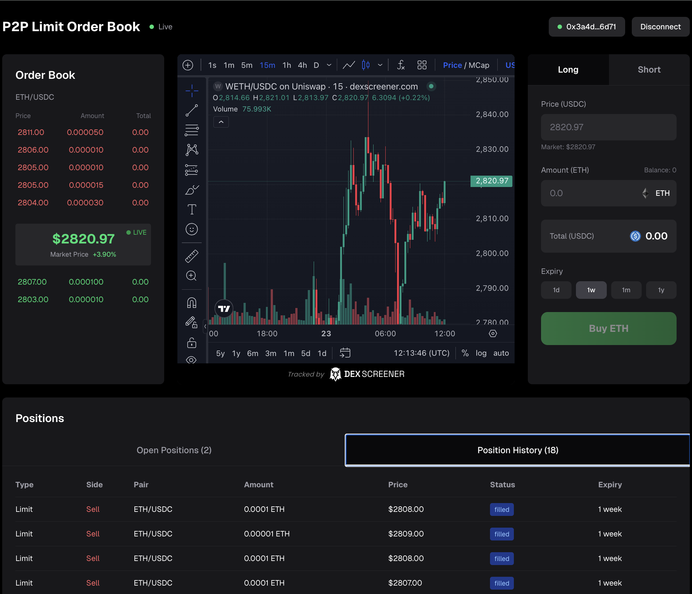

# Order Book



A decentralized peer-to-peer limit order book built with real-time WebSocket communication and ERC-7824 Nitrolite state channels for trustless trade settlement.

---

## 🎯 Overview

**Order Book** is a fully functional P2P trading platform that enables users to create limit orders for ETH/USDC trading pairs with automatic matching, partial fills, and settlement through Yellow Network's Nitrolite protocol.

### Key Features

- ✅ **Real-time Order Matching** - Automatic price-time priority matching engine
- ✅ **Partial & Full Fulfillment** - Orders can be filled incrementally (10% minimum)
- ✅ **WebSocket Communication** - Live order updates and instant match notifications
- ✅ **State Channel Settlement** - ERC-7824 compliant Nitrolite sessions for off-chain execution
- ✅ **Automatic Session Signing** - Seamless MetaMask integration for signature collection
- ✅ **Live Market Data** - Real-time ETH price feed from DexScreener
- ✅ **Order Book Visualization** - Bid/ask spread with depth display

---

## 🏗️ Architecture

### P2P Order Book System

The platform operates as a decentralized order book where:

1. **Makers** create limit orders (buy or sell) at specific prices
2. **Takers** submit orders that match existing orders on the opposite side
3. **Matching Engine** automatically finds compatible orders based on:
   - Price compatibility (buy ≥ sell price)
   - Time priority (first-in-first-out)
   - Minimum fill thresholds (10% of order size)

### Partial vs Full Fulfillment

**Full Fulfillment**
- Order is completely filled in a single transaction
- Both maker and taker amounts match perfectly
- Order moves to "Position History" immediately

**Partial Fulfillment**
- Order is filled incrementally across multiple trades
- Each fill must meet the 10% minimum threshold
- Remaining order stays in "Open Positions" until fully filled
- UI shows "Partial" status with orange badge

**Example:**
```
Order: Sell 1 ETH @ $2810
Match 1: 0.3 ETH filled → Status: Partially Filled (30%)
Match 2: 0.5 ETH filled → Status: Partially Filled (80%)
Match 3: 0.2 ETH filled → Status: Filled (100%)
```

---

## 🔌 WebSocket Communication

The platform uses WebSocket connections for real-time bidirectional communication between clients and server:

### Server → Client Messages

```typescript
{
  type: 'order.created' | 'order.updated' | 'order.cancelled',
  data: { order details }
}

{
  type: 'trade.matched',
  data: {
    tradeId, makerOrderId, takerOrderId,
    makerAddress, takerAddress,
    fillQuantity, price, sessionData
  }
}

{
  type: 'session.submitted',
  data: { tradeId, status: 'submitted' }
}
```

### Client → Server Messages

```typescript
{
  type: 'order.create',
  data: {
    maker, baseToken, quoteToken,
    side: 'buy' | 'sell',
    price, size, minFill
  }
}

{
  type: 'session.sign',
  data: { tradeId, signature, signerAddress }
}
```

---

## 🌐 ERC-7824 Nitrolite Integration

### What is ERC-7824?

ERC-7824 defines a standard for **state channels** - off-chain execution layers that enable:
- Fast, low-cost transactions
- Trustless settlement without intermediaries
- Cryptographic guarantees of execution

### Nitrolite Protocol

**Nitrolite** is Yellow Network's implementation of ERC-7824, providing:

1. **Session Creation** - When orders match, a Nitrolite session is created with:
   - App definition (participants, voting weights, quorum)
   - Allocations (token amounts for each participant)
   - Trade metadata (prices, amounts, fees)

2. **Signature Collection** - All participants must sign:
   - Maker signature
   - Taker signature
   - Server signature (settlement coordinator)

3. **ClearNode Submission** - Once all signatures collected:
   - Session submitted to Yellow Network's ClearNode
   - Trade executes in state channel
   - Settlement occurs off-chain with on-chain finality

### Session Flow

```
1. Orders Match
   ↓
2. Generate Session (server signs)
   ↓
3. Request User Signatures (maker + taker)
   ↓
4. Collect All Signatures (3/3)
   ↓
5. Submit to ClearNode
   ↓
6. Execute Trade in State Channel
   ↓
7. Update Balances
```

### Code Example

```typescript
// Session creation in OrderMatcher
const sessionData = await generateTradeSessionMessage(
  tradeId,
  makerOrder,
  makerAddress,
  takerAddress,
  fillQuantity,
  nitroliteClient
);

// Automatic signature on match
const message = JSON.stringify(sessionData.requestToSign);
const signature = await ethereum.request({
  method: 'personal_sign',
  params: [messageHash, userAddress]
});

// Submit to ClearNode when all signed
await nitroliteClient.send(signedMessage);
```

---

## 🚀 Technical Stack

### Frontend
- **Next.js 16** - React framework with App Router
- **TypeScript** - Type-safe development
- **Tailwind CSS** - Utility-first styling
- **Supabase** - PostgreSQL database with real-time subscriptions
- **WebSocket Client** - Custom client with auto-reconnect
- **MetaMask** - Wallet integration for signatures

### Backend
- **Node.js + TypeScript** - Server runtime
- **WebSocket Server** - Real-time bidirectional communication
- **Nitrolite Client** - Yellow Network state channel integration
- **Supabase** - Order persistence and real-time updates
- **OrderMatcher** - Automatic matching engine with partial fill support

---

## 📦 What We've Achieved

### ✅ Core Functionality
- Full order lifecycle management (create, update, cancel, fill)
- Real-time order book with bid/ask spread
- Automatic price-time priority matching
- Partial fill support with 10% minimum threshold
- Live market price integration from DexScreener

### ✅ State Channel Integration
- ERC-7824 compliant Nitrolite session generation
- Automatic signature collection from all participants
- ClearNode submission for off-chain settlement
- Trade execution in Yellow Network state channels

### ✅ User Experience
- Seamless MetaMask integration
- Automatic session signing on order fill
- Real-time position tracking (Open vs History)
- Fulfillment status indicators (Full/Partial/Unfilled)
- Live WebSocket status indicator

### ✅ Developer Experience
- Type-safe TypeScript throughout
- Modular architecture with clear separation of concerns
- Comprehensive logging for debugging
- Real-time database subscriptions
- Auto-reconnecting WebSocket connections

---

## 🎮 Getting Started

### Prerequisites
- Node.js 18+
- pnpm
- MetaMask browser extension
- Supabase account (or use provided credentials)

### Installation

```bash
# Clone the repository
git clone https://github.com/eliashezron/ethglobal-BA.git
cd ethglobal-BA

# Install dependencies
cd client && pnpm install
cd ../server && pnpm install

# Start the WebSocket server
cd server
pnpm run dev:ws

# Start the frontend (in a new terminal)
cd client
pnpm run dev
```

### Usage

1. **Connect Wallet** - Click "Connect Wallet" to link MetaMask
2. **Create Order** - 
   - Select "Long" (buy) or "Short" (sell)
   - Enter price and amount
   - Click "Buy ETH" or "Sell ETH"
3. **Automatic Matching** - Server matches compatible orders instantly
4. **Sign Session** - MetaMask prompts for signature when order fills
5. **View Positions** - Track orders in "Open Positions" and "Position History" tabs

---

## 🔮 Future Enhancements

- Multi-token pair support
- Advanced order types (stop-loss, take-profit)
- Order book depth visualization
- Trade history and analytics
- Mobile responsive design
- Multi-wallet support

---

## 📄 License

MIT

---

## 🙏 Acknowledgments

Built with [Yellow.com](https://yellow.com) Nitrolite protocol and [ERC-7824](https://eips.ethereum.org/EIPS/eip-7824) state channel standard.
